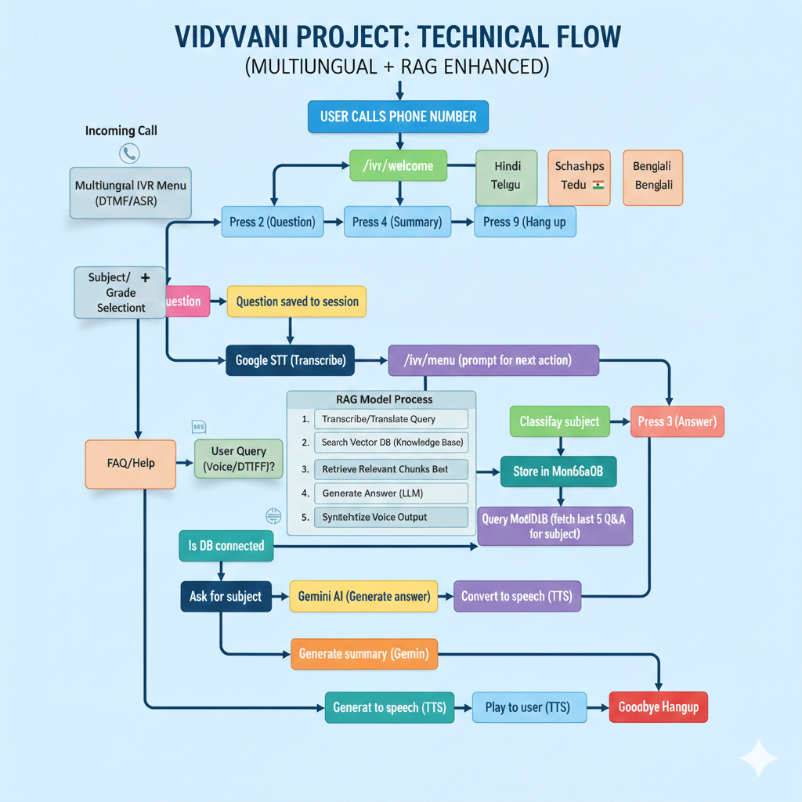

# **VIDYA VANI**

### *Knowledge at Your Call*

---

## 🎓 About Vidya Vani

**Vidya Vani** is an AI-powered educational voice assistant that makes learning accessible to everyone through simple phone calls. No internet, no smartphone, no app required—just dial a number, ask your question, and get instant AI-generated answers spoken back to you.

The system bridges the digital divide by providing 24/7 educational support to students in rural and underserved areas who may not have access to computers or smartphones but have basic phone connectivity.

**Key Features:**
- 📞 Works on any phone (landline or mobile)
- 🎤 Voice-based interaction—just speak naturally
- 🤖 AI-powered answers using Google Gemini
- 🔊 High-quality speech recognition (90–95% accuracy)
- 🌍 Accessible anywhere, anytime
- ⚡ Real-time responses in seconds
- 🗣️ **NEW:** Multi-language support (English, Hindi, Telugu, more)
- 💾 **NEW:** Question history stored in MongoDB
- 📚 **NEW:** Automatic subject classification (Physics, Chemistry, Biology, Math)
- 📊 **NEW:** Learning summaries based on your question history

---

## 🏗️ Technology Stack & Architecture

### **Why We Chose Each Technology**



---

## 📦 Quick Installation Guide

### **Step 1: Install Dependencies**
```bash
cd Vidya-Vani/twilio-phone-call
npm install
```

### **Step 2: Configure Environment**
```bash
cp .env.example .env
```
Edit `.env` with the following:
- `TWILIO_ACCOUNT_SID`
- `TWILIO_AUTH_TOKEN`
- `GEMINI_API_KEY`
- `GOOGLE_TTS_KEY_FILE=./google-credentials.json`
- `MONGODB_URI=mongodb://localhost:27017/vidya-vani`
- `LANGUAGE=en-IN` *(Options: `en-IN`, `hi-IN`, `te-IN`, etc.)*

### **Step 3: Setup MongoDB**
- Local or Atlas setup with test via `npm run test-mongodb`

### **Step 4: Add Google Credentials**
- Place `google-credentials.json` and enable STT and TTS APIs

### **Step 5: Start ngrok**
```bash
ngrok http 3000
```

### **Step 6: Configure Twilio Webhook**
```bash
# Twilio → Phone Numbers → Webhook: https://<ngrok>.ngrok.io/ivr/welcome
```

### **Step 7: Start Server**
```bash
npm run server
```

---

## 🌐 Multi-Language Support

Supported:
- English (`en-IN`)
- Hindi (`hi-IN`)
- Telugu (`te-IN`)

Switch by updating `.env`:
```env
LANGUAGE=hi-IN
```

---

## 📱 How to Use

### Phone Menu:
1. Press 1 – Ask a question  
2. Press 2 – Stop recording  
3. Press 3 – Get answer  
4. Press 4 – Summary  
5. Press 9 – End call

---

## 📚 MongoDB Features

- Subject classification (Physics, Chemistry, etc.)
- Timestamped Q&A history
- AI-powered learning summaries by subject

---

## 🎓 Educational Impact

Vidya Vani democratizes AI-driven education by:
- Reaching non-internet users
- Supporting native languages
- Offering 24/7 voice-based learning

---

**Built with ❤️ for inclusive and multilingual education**
